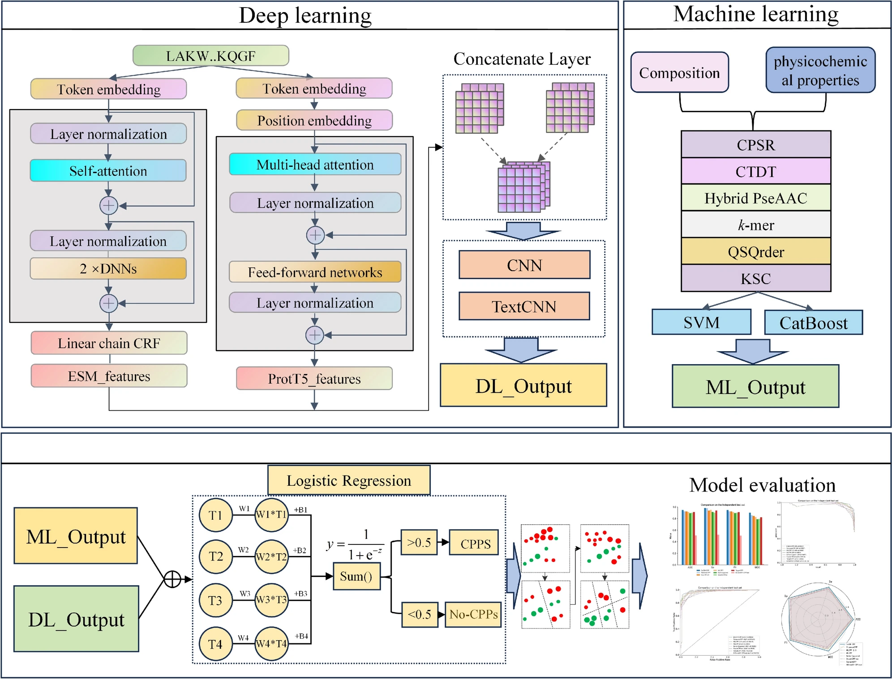

1. Brush up on the maths of matmul.
2. Learn the general graph neural network maths.
3. Work on a specific graph paper.
4. Learn the general attention & transformer maths.
5. Work on a specific graph paper.

# Resources
- Prof Tom Yeh site: https://www.byhand.ai/ for the basic.
- GraphCPP for a graph neural network architecture to predict protein cell penetration capability: https://bpspubs.onlinelibrary.wiley.com/doi/10.1111/bph.17388
- EnDM-CPP for a transformer architecture to predict protein cell penetration capability: https://link.springer.com/article/10.1007/s12539-024-00673-4
- Codes:
  - https://github.com/attilaimre99/GraphCPP/
  - https://github.com/tudou1231/EnDM-CPP

# Basic
Done!

# Graph Basic
Graph is a heterogeneous data structure that is used to represent objects with certain properties and their arbitrary relationships. As such, the graph actually represents a large part of the world. Applying them in machine learning presents some challenge. Because machine learning was developed for structured, fixed-size data structure such as images and texts (essentially vectors and matrix) but graph is non-structured. So their natural representation such as adjacency list doesn't fit nicely into conventional machine learning methods.

*Node embedding* is used to bridge the gap between graph and machine learning. Information at the nodes (which often is what we are interested in) is process into latent embedding of a fixed size (just like with text) that can multiply nicely with the weight matrix to be used in machine learning. **This is an important internal component of most common graph NN architecture**.

For a graph with $V$ nodes, there can be $V!$ node orderings. Hence, we need a network architecture that each layer function is permutation equivariant/invariant i.e., the output does not depend on the particular order of the graph nodes that is passed in. The idea is to compute the embedding of a node based on the (aggregate) properties of itself and its neighborhood.

> This graph neural network formulation is the generalization of convolution neural network on images and attention mechanism on texts.

The general computational steps of this is generalized as **message and aggregation** with
1. **Message**: each node computes a message  
$$
\mathbf{m}_u^{(l)}=\mathrm{MSG}^{(l)}\!\left(\mathbf{h}_u^{(l-1)}\right),\; u\in\{N(v)\cup v\}
$$

2. **Aggregation**: aggregate messages from neighbors  
$$\mathbf{h}_v^{(l)}=\mathrm{AGG}^{(l)}\!\left(\left\{\mathbf{m}_u^{(l)},\,u\in N(v)\right\},\,\mathbf{m}_v^{(l)}\right)$$

3. **Nonlinearity (activation)**: adds expressiveness  
  - Often written as σ(·). Examples: ReLU(·), Sigmoid(·), ...  
  - Can be added to **message** or **aggregation**

Example for **a typical mean-aggregator GCN-style** update with a self-term:

$h_v^{(0)} = x_v$ 

$h_v^{(k+1)} = \sigma\left(W_k\sum_{u\in N(v)}\frac{h_u^{(k)}}{|N(v)|}+B_k h_v^{(k)}\right),\ \forall k\in{0,\dots,K-1}$

$z_v = h_v^{(K)}$

with
- $h_v^{k}$: the hidden representation of node $v$ at layer $k$.
- $W^{k}$: weight matrix for neighborhood aggregation.
- $B^{k}$: weight matrix for transforming hidden vector of self.

To work up to GraphCPP, I would need to learn about another classic layer **GraphSAGE**
$$
h_v^{(l)} = \sigma\Big( \mathbf{W}^{(l)} \cdot \operatorname{CONCAT}\big( \mathbf{h}_v^{(l-1)}, \operatorname{AGG}({\mathbf{h}_u^{(l-1)}, \forall u \in N(v)}) \big) \Big)
$$
There are several modifications:
- 2-stage aggregation: instead of summed into, the node embedding is concat with the neighbor's aggregated message. This helps to separate self and neighbor's features, so that they can be processed independently.
- The aggregation function is *arbitrary*, which means that it can be any type, even a whole neural network e.g., LSTM (used to reshuffle neighbors).
- (Optional) Apply $\ell_2$ normalization to $h_v^{(l)}$ at every layer for possible performance improvement.

# GraphCPP
I amd interested in the following aspects of the model:
- Data preprocessing
- Model architecture

## Data preprocessing
The initial data format is an SMILES string e.g., CC(C)C[C@H](NC(=O)[C@H](CCCCN)NC(=O)). It is featurized with `deepchem`'s [`MolGraphConvFeaturizer`](https://deepchem.readthedocs.io/en/latest/api_reference/featurizers.html#molgraphconvfeaturizer), which creates representations for the nodes and edges of the molecule (essentially its atoms and bonds) based on predefined 32 node features and 11 edge features.

The data container is defined with the conventional `Dataset` and `DataLoader` from PyG. As the authors used Lighting, they wrapped the data loaders in `LightningDataModule` as another layer.

Example of a single batch:
```bash
Batch 0:
  Batch type: <class 'abc.DataBatch'>
  Batch keys: ['x', 'edge_index', 'edge_attr', 'smiles', 'ptr', 'name', 'fp', 'y', 'batch']
  Node features shape: torch.Size([87686, 32])
  Labels shape: torch.Size([512])
  Edge index: torch.Size([2, 178724])
  Edge attr: torch.Size([178724, 11])
```
From this we can see that:
- There are 512 molecules in this batch.
- There are 87686 nodes(atoms) and178724 edges(bonds) in the graph. In PyG, the edges are directed edges, so each (undirected) bond in the molecules is represented as two directed edges in the graph. The edges in the graph are stored as 2 arrays of source nodes and target nodes so that we see the edge index has a shape of 2
- There are 32 features for the Note and 11 features for the edges.

# Model architecture
The most primitive level is defined in `generalconv.py`. The author defined their own General Convolational Layer for both nodes and edges from the base `MessagePassing` class of PyG. `MessagePassing` class already implements the message propagation mechanism, so class inheriting it only needs to define the `message` and `update`, corresponding to the Message and Agregation scheme. The authors further defined parameter initialization, normalization updates, and forward pass.

The model is defined in `model.py`. The model structure is actually very brief, divided into three stages: before, message passing itself, and after.
```python
self.pre_mp = GeneralMultiLayer(
    name="linear",
    num_layers=layers_pre_mp,
    dim_in=32,
    dim_out=hidden_channels,
    dim_inner=hidden_channels,
    final_act=True,
    **kwargs
)
self.mp = GNNStackStage(
    dim_in=hidden_channels,
    dim_out=hidden_channels,
    num_layers=mp_layers,
    stage_type=stage_type,
    **kwargs
)
self.post_mp = GNNGraphHead(hidden_channels, 1, layers_post_mp, **kwargs)
```
The model architecture flow:
```bash
Input Graph (32-dim node features)
         ↓
Pre-MP: Linear layers (32 → hidden_channels)
         ↓
MP: GNN layers (hidden_channels → hidden_channels)
         ↓
Post-MP: Pooling + MLP (hidden_channels → 1)
         ↓
Final Prediction (1-dim output)
```
The Pre-MessagePassing layer is a normal stack of linear layer to process the inputs from the batch defined above. It has the usual packs: L2 normalization, dropout, batch normalization, activation. In the actual research model, the pre-processing stage consists of a single linear layer (`'layers_pre_mp': 1`) that transforms 32-dimensional atomic features to 128-dimensional hidden representations (`'hidden_channels': 128`).

The MessagePassing is the stack of GNN layers, using the GraphSAGE layer discussed above. In the actual research model, it's also small with just 2 layers (`'mp_layers': 2`) of SAGEConv (`'layer_type': 'sageconv'`) stacked on each other (`'stage_type': 'stack'`).

The Post-MessagePassing layer is a global pooling + 1 MLP layer with Morgan fingerprint to output the final prediction.

There are other GNN layers already implemented by the authors (including graph transformer convolution layer) but ultimately not used.

The training is carried out with Lightning, so everything is wrapped by another Lightning layer in `lightning.py`.

> I tried to run a single run of the model and log the output to log.txt. There were some errors (like with ANY research codebase 😡). It runs and offers some results. Based on time interest, I could not run the training to the end at the time of writing this.

# Transformer basic

The core idea behind the Transformer model is the **attention mechanism**. To me, it is best described as a mechanism to compute similarity for retrieval from a database with a specific query. Imagine a database as a dictionary with key-values pairs $\mathbf{k}-\mathbf{v}$. Let's say I have a query $\mathbf{q}$ that asks for specific things from the database. Then the attention is defined as
$$
\textrm{Attention}(\mathbf{q}, \mathcal{D}) \stackrel{\textrm{def}}{=} \sum_{i=1}^m \alpha(\mathbf{q}, \mathbf{k}_i) \mathbf{v}_i,
$$
with $\alpha(\mathbf{q}, \mathbf{k}_i) \in \mathbb{R}$ are scalar attention weights. The sum operation is referred as **attention pooling**. $\alpha$ is the **attention scoring function**; a well-known choice is the **scaled dot product attention** function.
$$
\alpha(\mathbf{q}, \mathbf{k}_i) = \mathrm{softmax}(a(\mathbf{q}, \mathbf{k}_i)) = \frac{\exp(\mathbf{q}^\top \mathbf{k}_i / \sqrt{d})}{\sum_{j=1} \exp(\mathbf{q}^\top \mathbf{k}_j / \sqrt{d})}.
$$
$\mathbf{q}$, $\mathbf{k}$, $\mathbf{v}$ In this case are fixed-sized embeddings created from the inputs. They can come from the same sequence in the case of self-attention or from different sequences from the encoder and decoder in the cross-attention case. Nowadays, however, when we refer to Transformer, almost always we are referring to the self-attention case.

The embedding, as above, is generated by training some linear layers to transform the input. For the case of language modeling, the embedding is pre-calculated into a lookup table (**embedding matrix**). The sequence of text is tokenized into tokens, each assigned an ID, used to look up for its predefined embedding from the embedding matrix.

# EnDM-CPP
The "En" is for "Ensemble". It is an ensemble deep learning model, some of whose sub-models use attention mechanism.

## Data
The dataset is (once again) a combination of many other datasets e.g., C2Pred, CellPPD, CPPred-RF, KELM-CPPpred, MLCPP, and BChemRF CPPred. The original sequence is denoted in FASTA as opposed to SMILES above.

The ensemble is divided into 2 "branches", traditional machine learning and deep learning. The FASTA sequence is passed into 2 separate feature extraction pipelines
- Stream 1 (**Transformer features**): The FASTA sequence is passed through ProtT5 and ESM-2 to generate 1024 embeddings from each. 
- Stream 2 (**Traditional features**): The FASTA sequence is used to compute traditional features.

I am not sure how exactly are the features combined in each stream as I don't see it in the repo. The embeddings from the 2 streams are not combined: stream 1 is passed to deep learning models, stream 2 is passed to machine learning models.



The prediction is a weighted average from both streams, and the weight is trainable via a logistic regression layer.